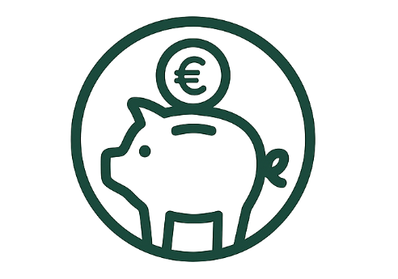
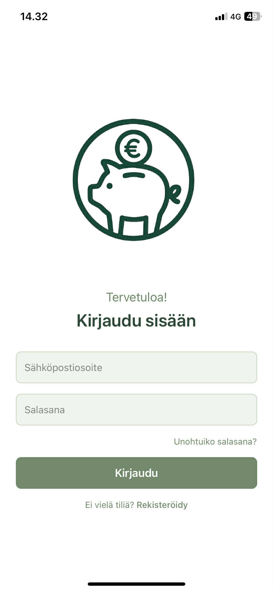
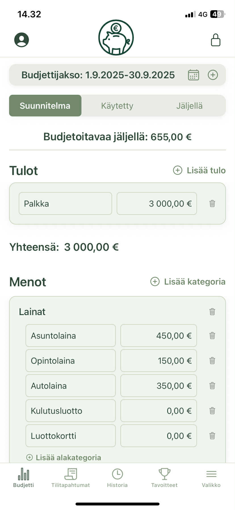

#  Budjetointi-sovellus



Budjetointisovellus on **React Native**- ja **Expo**-pohjainen mobiilisovellus henkilökohtaisen talouden hallintaan.  
Sovelluksella voit seurata tuloja, menoja ja säästötavoitteita sekä pitää kirjaa budjettijaksoista.

---

##  Ominaisuudet

- Käyttäjäautentikointi Firebase Authin avulla  
- Budjettijaksojen luonti ja arkistointi  
- Kulujen ja tulojen kirjaus kategorioihin  
- Toistuvat menot ja ilmoitukset  
- Säästötavoitteiden seuranta ja lomabudjetointi  
- Tilastot ja graafit Victory-kirjastolla  

---

##  Teknologiat

- [Expo](https://expo.dev/) & React Native  
- TypeScript  
- Firebase (Auth & Firestore)  
- Victory Native  
- Expo Router  

---

##  Asennus ja kehitys

**Vaatimukset:** Node.js ≥ 18 ja npm  

Kloonaa repository ja siirry kansioon:

```bash
git clone <repo-url>
cd budjetointi-sovellus
npm install

Käynnistys:

npm run android        # Avaa Android-emulaattorissa
npm run ios            # Avaa iOS-simulaattorissa
npm run web            # Avaa selaimessa
npm run lint           # Suorita linttaus
npm run reset-project  # Tyhjennä projektin aloitustiedostot


 Projektirakenne

app/              # Näytöt ja reitit (Expo Router)
  assets/         # Kuvia ja fontteja
  components/     # Uudelleenkäytettävät UI-komponentit
  constants/      # Sovelluksen vakiot
  hooks/          # Custom hookit
  scripts/        # Apuskriptit
src/
  api/            # Firebase-konfiguraatio
  services/       # Sovelluslogiikka (budjetit, menot, tulot...)
  utils/          # Apufunktiot


Kuvakaappaukset


| Kirjautuminen                                          | Budjetti                                     | Tilitapahtumat                                           |
| ------------------------------------------------------ | -------------------------------------------- | -------------------------------------------------------- |
|  |  |  |


